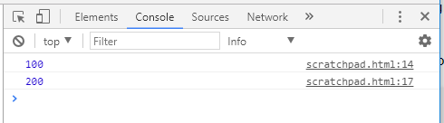
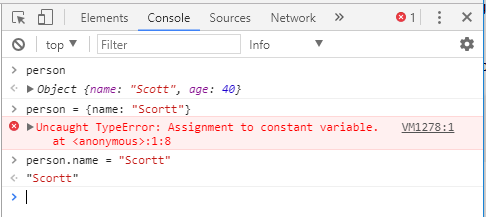

# ES6 Cheat Sheet

I have put this together as a collection of the things I have learned for JavaScript ES6 and JavaScript in general

<!-- TOC -->

- [ES6 Cheat Sheet](#es6-cheat-sheet)
  - [Variables](#variables)
    - [`var`](#var)
    - [`let`](#let)
    - [`const`](#const)
    - [Scoping](#scoping)
    - [`const` vs. `let`](#const-vs-let)

<!-- /TOC -->

## Variables

There are three ways to declare variables in JavaScript now `var`, `let` and `const` 

### `var`

`var` has always been used in JavaScript [as far as I know] `var` can be updated and reassigned you can even create the same `var` twice:

```
var id = 100
console.log(id)

var id = 200
console.log(id)
```



This will not throw any errors in the browser [Chrome dev tools pictured] so there is the possibility that you could use the same variable name twice in your code and get some unexpected results.

### `let`

`let` variables can be updated and are block scoped.

### `const`

`const` variables can not be updated, however you can change attributes of a constant.

```
const person = {
  name: 'Scott'
  age: 40
}

// will throw an error 
person = {name: 'Scottland'}

// will allow the attribute to change
person.name = 'Scort'

```



### Scoping

Quick overview of scoping, `let` and `const` are not `function` scoped variables they're `block` scoped variables, what does that mean? 

```
function indexKey(params) {
  // let and const variables inside this function can not be used outside of it
  let index = 200
  console.log(index)
  const key = '78910'
  console.log(key)
}
// the variables will not be available outside of the function 
console.log(index)
console.log(key)
```

Basically any `let` or `const` will be scoped to their containing curly brackets `{}` they don't need to be in a function just the brackets


### `const` vs. `let`

Great article here by Mathias Bynens:

[https://mathiasbynens.be/notes/es6-const](https://mathiasbynens.be/notes/es6-const)

I will be attempting to use the following [from Mathias' post] in my code

* use `const` by default
* only use `let` if rebinding is needed
* (`var` shouldn’t be used in ES6)

Simples :sunglasses:

